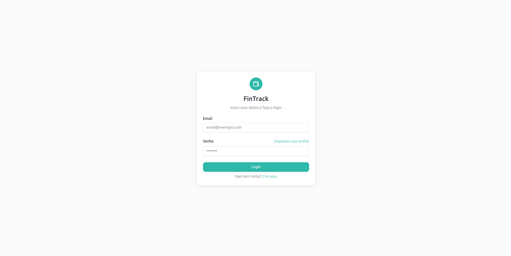
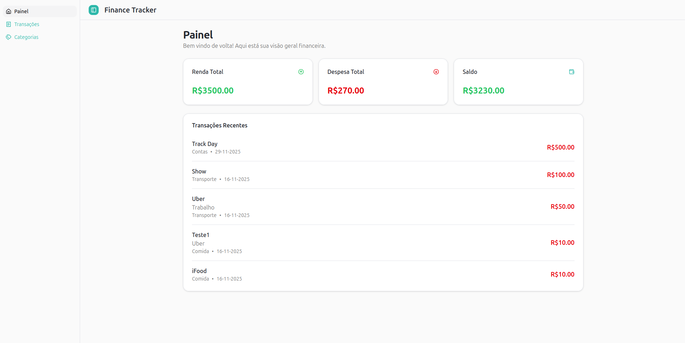
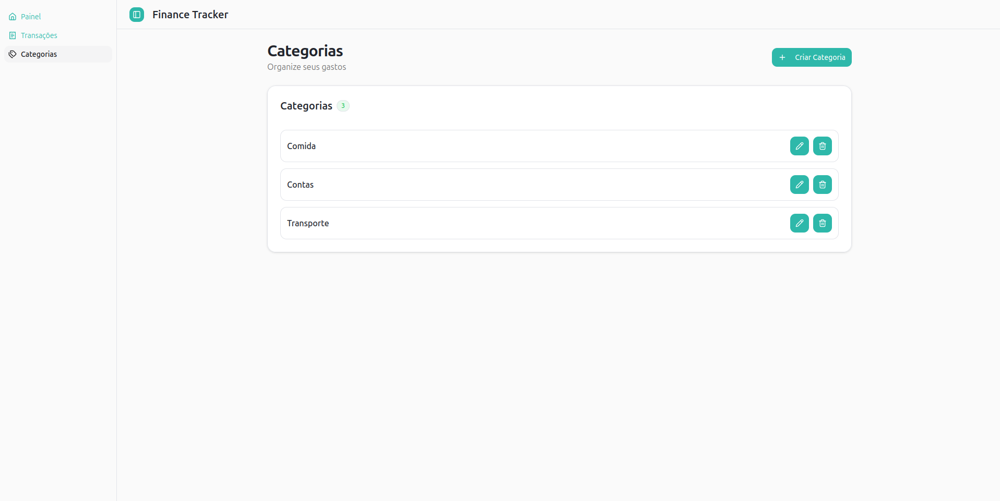
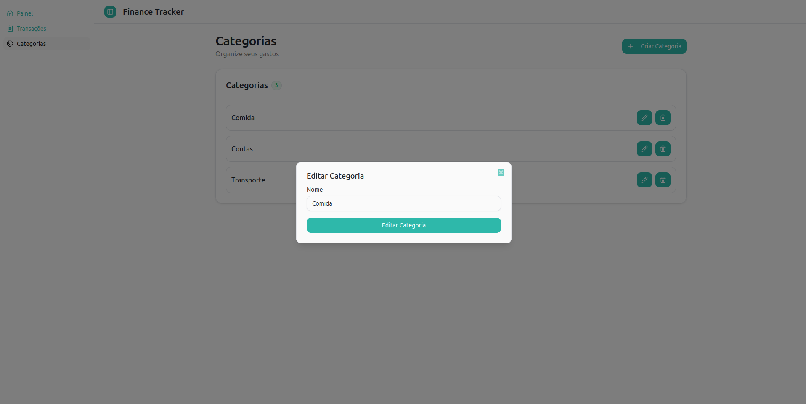
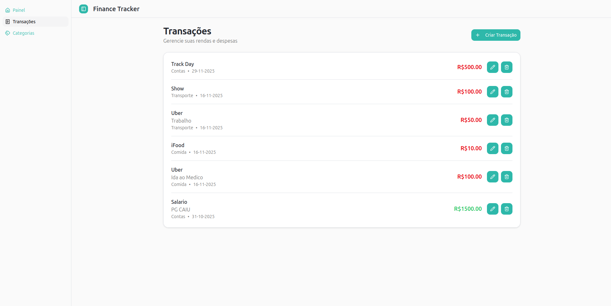
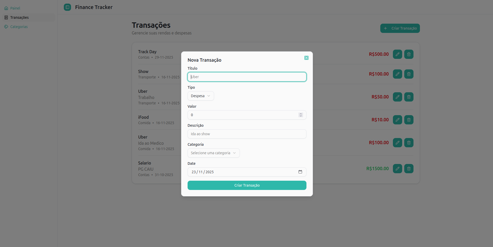

# 💰 Finance Tracker


Uma aplicação em React, para gerenciamento de finanças pessoais

Essa aplicação consome a **[Finance Tracker API](https://github.com/ribeiro-dev/finance-tracker-api)** e fornece uma UI intuitiva, para rastrear rendas, despesas e um resumo financeiro

Criado para demonstrar práticas modernas de front-end, integração de API no mundo real, arquitetura de componentes limpa e uma experiência de usuário fluida.

<p>
  
  
</p>

<p>
  
  
</p>

<p>
  
  
</p>

## ✨ Features

- Autenticação JWT
- CRUD de Transações
- Gerenciamento de Categorias
- Dashboard com resumo financeiro e gráficos
- Mobile-first Design
- Integração de API robusta com tratamento de erros
- Interface clean com Shadcn

## 🛠️ Tech Stack

### Frontend

- React
- TypeScript
- React Hook Form + Zod
- TanStack Query
- TailwindCSS
- Shadcn
- Recharts
- Axios
- Vite

## 🧠 Design Highlights

- Estrutura Escalável
- Componentes reutilizáveis
- Mobile-first UX

## 🚀 Rodando o Projeto

```bash
git clone https://github.com/ribeiro-dev/finance-tracker-fe.git
cd finance-tracker-fe
npm install
```

Crie o arquivo `.env`:

```text
VITE_API_URL=http://localhost:3333
```

Inicie o servidor:

```bash
npm run dev
```

## 📁 Estrutura do Projeto

```text
src/
  components/
  interfaces/
  lib/
  pages/
  services/
  stores/
  styles/
```

## 📦 Build

```bash
npm run build
```

## 🙌 Aprendizados

- Shadcn
- Tailwind
- TanStack Query
- AdonisJS API
